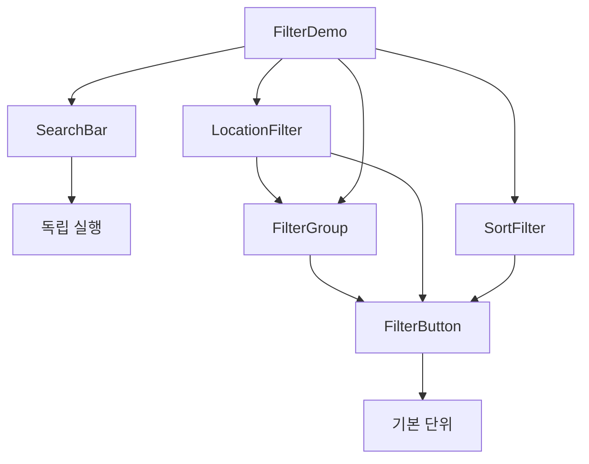

# 필터 및 검색 컴포넌트 가이드

## 📋 개요

PawMap 프로젝트의 검색 및 필터링 시스템은 5개의 핵심 컴포넌트로 구성되어 있습니다. 모든 컴포넌트는 재사용 가능하고 조합 가능하며, 반응형 디자인을 지원합니다.

### 🏗 아키텍처

```
FilterButton (기본 단위)
├── FilterGroup (여러 버튼 조합)
├── LocationFilter (위치 선택)
├── SortFilter (정렬 옵션)
└── SearchBar (독립적 검색)
```

## 🔍 SearchBar 컴포넌트

### 기능

- 실시간 검색어 입력 및 클리어
- 엔터키 검색 실행
- 포커스 상태 관리
- 3가지 크기 지원 (small, medium, large)

### Props

```typescript
interface SearchBarProps {
  placeholder?: string; // 기본: "검색어를 입력하세요"
  value?: string; // 검색어 값
  onChange?: (value: string) => void; // 입력 변경 콜백
  onSearch?: (value: string) => void; // 검색 실행 콜백
  onClear?: () => void; // 클리어 콜백
  disabled?: boolean; // 비활성화 상태
  size?: "small" | "medium" | "large"; // 크기
}
```

### 사용 예시

```jsx
import SearchBar from "./components/SearchBar/SearchBar";

const [searchQuery, setSearchQuery] = useState("");

<SearchBar
  placeholder="동물병원, 애견카페 등을 검색해보세요"
  value={searchQuery}
  onChange={setSearchQuery}
  onSearch={(query) => console.log("검색:", query)}
  size="medium"
/>;
```

### 주요 특징

- 검색 아이콘과 클리어 버튼 내장
- 모바일에서 세로 레이아웃으로 변경
- 포커스 시 primary 색상 하이라이트

---

## 🔘 FilterButton 컴포넌트

### 기능

- 기본 필터 버튼 UI 제공
- 활성/비활성 상태 관리
- 드롭다운 화살표 표시
- 뱃지 표시 (선택 개수 등)

### Props

```typescript
interface FilterButtonProps {
  children: React.ReactNode; // 버튼 내용
  isActive?: boolean; // 활성 상태
  hasDropdown?: boolean; // 드롭다운 화살표 표시
  isOpen?: boolean; // 드롭다운 열림 상태
  onClick?: () => void; // 클릭 콜백
  disabled?: boolean; // 비활성화 상태
  variant?: "default" | "outline" | "ghost"; // 스타일 변형
  size?: "small" | "medium" | "large"; // 크기
  badge?: string | number; // 뱃지 표시
}
```

### Variant 스타일

- **default**: 기본 스타일, 활성 시 primary 색상
- **outline**: 테두리만 있는 스타일
- **ghost**: 배경 없는 투명 스타일

### 사용 예시

```jsx
import FilterButton from "./components/FilterButton/FilterButton";

<FilterButton
  isActive={isSelected}
  onClick={handleClick}
  variant="outline"
  badge={selectedCount > 0 ? selectedCount : null}
>
  편의시설
</FilterButton>;
```

---

## 📋 FilterGroup 컴포넌트

### 기능

- 여러 FilterButton을 그룹화
- 단일 또는 다중 선택 지원
- 선택 개수 표시 및 전체 해제
- wrap/scroll 레이아웃 옵션

### Props

```typescript
interface FilterGroupProps {
  title?: string; // 그룹 제목
  options: Array<
    | string
    | {
        // 옵션 목록
        value: string;
        label: string;
        disabled?: boolean;
      }
  >;
  value: string | string[]; // 선택된 값(들)
  onChange: (value: string | string[]) => void; // 변경 콜백
  multiple?: boolean; // 다중 선택 여부
  disabled?: boolean; // 비활성화 상태
  variant?: "default" | "outline" | "ghost"; // 버튼 스타일
  size?: "small" | "medium" | "large"; // 버튼 크기
  layout?: "wrap" | "scroll"; // 레이아웃 방식
}
```

### 사용 예시

```jsx
import FilterGroup from "./components/FilterGroup/FilterGroup";

const facilityOptions = [
  { value: "parking", label: "주차장" },
  { value: "reservation", label: "예약가능" },
  { value: "group", label: "단체석" },
];

<FilterGroup
  title="편의시설"
  options={facilityOptions}
  value={selectedFacilities}
  onChange={setSelectedFacilities}
  multiple={true}
  layout="wrap"
/>;
```

### 레이아웃 옵션

- **wrap**: 버튼들이 줄바꿈되어 표시
- **scroll**: 가로 스크롤로 표시 (모바일 친화적)

---

## 📍 LocationFilter 컴포넌트

### 기능

- GPS 기반 "내 주변" 위치 검색
- 전국 18개 지역 선택
- 위치 권한 요청 및 에러 처리
- 현재 좌표 표시

### Props

```typescript
interface LocationFilterProps {
  value: {
    type: "all" | "nearby" | "region"; // 위치 타입
    region?: string; // 선택된 지역
    coordinates?: { lat: number; lng: number }; // GPS 좌표
  };
  onChange: (value: LocationValue) => void; // 변경 콜백
  disabled?: boolean; // 비활성화 상태
  showNearby?: boolean; // "내 주변" 버튼 표시 여부
}
```

### 위치 타입

- **all**: 전체 지역 (제한 없음)
- **nearby**: GPS 기반 현재 위치
- **region**: 특정 지역 선택

### 사용 예시

```jsx
import LocationFilter from "./components/LocationFilter/LocationFilter";

const [location, setLocation] = useState({
  type: "all",
  region: "all",
});

<LocationFilter value={location} onChange={setLocation} showNearby={true} />;
```

### GPS 에러 처리

컴포넌트는 다음 상황을 자동 처리합니다:

- 위치 권한 거부
- GPS 사용 불가
- 요청 시간 초과
- 위치 정보 가져오기 실패

---

## 🔀 SortFilter 컴포넌트

### 기능

- 4가지 정렬 옵션 제공
- 드롭다운/인라인 두 가지 모드
- 모바일에서 하단 시트 스타일
- 아이콘과 설명 포함

### Props

```typescript
interface SortFilterProps {
  value: "distance" | "rating" | "popular" | "recent"; // 현재 정렬
  onChange: (value: string) => void; // 변경 콜백
  disabled?: boolean; // 비활성화 상태
  showDropdown?: boolean; // 드롭다운 모드 여부
  availableOptions?: SortOption[]; // 사용 가능한 옵션 (기본: 전체)
  size?: "small" | "medium" | "large"; // 크기
}
```

### 정렬 옵션

- **distance**: 가까운 순 (GPS 기반)
- **rating**: 평점 순 (높은 평점부터)
- **popular**: 인기 순 (리뷰 수 기준)
- **recent**: 최신 순 (등록일 기준)

### 사용 예시

```jsx
import SortFilter from './components/SortFilter/SortFilter';

// 데스크톱 - 드롭다운 모드
<SortFilter
  value={sortBy}
  onChange={setSortBy}
  showDropdown={true}
  size="medium"
/>

// 모바일 - 인라인 모드
<SortFilter
  value={sortBy}
  onChange={setSortBy}
  showDropdown={false}
  size="small"
/>
```

---

## 🔄 데이터 흐름 및 상태 관리

### Controlled Component 패턴

모든 필터 컴포넌트는 controlled component로 설계되었습니다.

```jsx
const FilterContainer = () => {
  // 각 필터의 상태를 부모에서 관리
  const [searchQuery, setSearchQuery] = useState("");
  const [location, setLocation] = useState({ type: "all", region: "all" });
  const [sortBy, setSortBy] = useState("distance");
  const [facilities, setFacilities] = useState([]);

  // 통합 필터 상태
  const filterState = {
    query: searchQuery,
    location,
    sort: sortBy,
    facilities,
  };

  // API 호출 또는 결과 필터링
  useEffect(() => {
    fetchResults(filterState);
  }, [filterState]);

  return (
    <div>
      <SearchBar value={searchQuery} onChange={setSearchQuery} />
      <LocationFilter value={location} onChange={setLocation} />
      <SortFilter value={sortBy} onChange={setSortBy} />
      <FilterGroup
        value={facilities}
        onChange={setFacilities}
        multiple={true}
      />
    </div>
  );
};
```

### Zustand와 연동

```jsx
import { useFilterStore } from "./stores/filterStore";

const FilterContainer = () => {
  const {
    searchQuery,
    location,
    sortBy,
    facilities,
    setSearchQuery,
    setLocation,
    setSortBy,
    setFacilities,
  } = useFilterStore();

  return (
    <div>
      <SearchBar value={searchQuery} onChange={setSearchQuery} />
      {/* ... 다른 필터 컴포넌트들 ... */}
    </div>
  );
};
```

---

## 📱 반응형 디자인

### 브레이크포인트

```scss
// _variables.scss에서 정의
$mobile: 480px; // 모바일
$tablet: 865px; // 태블릿
$desktop: 1024px; // 데스크톱
```

### 모바일 최적화

- **SearchBar**: 세로 레이아웃으로 변경
- **SortFilter**: 드롭다운 → 하단 시트
- **LocationFilter**: 버튼 크기 증가
- **FilterGroup**: 스크롤 레이아웃 활용
- **FilterButton**: 터치 친화적 최소 높이 (44px)

### 터치 최적화

```scss
@media (max-width: $mobile) {
  .filterButton {
    min-height: 44px; // 터치 친화적
    padding: 12px 16px;
  }
}
```

---

## 🎯 사용 패턴 및 모범 사례

### 1. 페이지별 필터 조합

```jsx
// 동물병원 페이지
const HospitalsPage = () => (
  <div>
    <SearchBar placeholder="동물병원 검색..." />
    <LocationFilter showNearby={true} />
    <SortFilter availableOptions={["distance", "rating"]} />
    <FilterGroup
      title="진료과목"
      options={medicalDepartments}
      multiple={true}
    />
  </div>
);

// 카페 페이지
const CafesPage = () => (
  <div>
    <SearchBar placeholder="애견 카페 검색..." />
    <LocationFilter />
    <SortFilter />
    <FilterGroup title="편의시설" options={cafeAmenities} multiple={true} />
  </div>
);
```

### 2. URL 동기화

```jsx
import { useSearchParams } from "react-router-dom";

const useFilterSync = () => {
  const [searchParams, setSearchParams] = useSearchParams();

  const updateFilter = (key, value) => {
    const params = new URLSearchParams(searchParams);
    if (value) {
      params.set(key, JSON.stringify(value));
    } else {
      params.delete(key);
    }
    setSearchParams(params);
  };

  return { searchParams, updateFilter };
};
```

### 3. 성능 최적화

```jsx
import { useMemo, useCallback } from "react";
import { debounce } from "lodash";

const FilterContainer = () => {
  // 검색 디바운싱
  const debouncedSearch = useCallback(
    debounce((query) => {
      // API 호출
    }, 300),
    []
  );

  // 필터 옵션 메모이제이션
  const facilityOptions = useMemo(
    () => [
      { value: "parking", label: "주차장" },
      { value: "reservation", label: "예약가능" },
    ],
    []
  );
};
```

---

## ⚠️ 주의사항 및 제한사항

### LocationFilter

- GPS 권한이 거부된 경우 적절한 대안 제시
- 위치 정확도가 낮을 수 있으므로 반경 설정 고려
- iOS Safari에서 HTTPS 필수

### SortFilter

- 드롭다운 모드에서 외부 클릭 감지를 위한 backdrop 필수
- 모바일에서 하단 시트가 화면을 가리지 않도록 주의

### FilterGroup

- `multiple` prop에 따라 value 타입이 달라짐 주의
- 대량의 옵션이 있을 경우 가상화 스크롤 고려

### 공통사항

- 모든 onChange 콜백은 optional로 처리
- disabled 상태일 때 모든 인터랙션 차단
- 접근성을 위한 키보드 내비게이션 지원

---

## 🔧 확장 가능성

### 새로운 필터 타입 추가

```jsx
// PriceRangeFilter.jsx
import FilterButton from "../FilterButton/FilterButton";

const PriceRangeFilter = ({ value, onChange }) => {
  const ranges = [
    { min: 0, max: 10000, label: "1만원 이하" },
    { min: 10000, max: 30000, label: "1-3만원" },
    { min: 30000, max: null, label: "3만원 이상" },
  ];

  return (
    <div>
      {ranges.map((range) => (
        <FilterButton
          key={`${range.min}-${range.max}`}
          isActive={isInRange(value, range)}
          onClick={() => onChange(range)}
        >
          {range.label}
        </FilterButton>
      ))}
    </div>
  );
};
```

### 동적 옵션 로딩

```jsx
const DynamicFilterGroup = ({ apiEndpoint, ...props }) => {
  const [options, setOptions] = useState([]);
  const [loading, setLoading] = useState(true);

  useEffect(() => {
    fetchOptions(apiEndpoint)
      .then(setOptions)
      .finally(() => setLoading(false));
  }, [apiEndpoint]);

  if (loading) return <FilterGroupSkeleton />;

  return <FilterGroup options={options} {...props} />;
};
```

---

## 📊 컴포넌트 의존성 그래프



---

## 🎨 디자인 토큰

### 색상

- Primary: `$primary-color` (#ba3e00)
- Success: `$success-color` (#2a9d8f)
- Error: `$error-color` (#e63946)
- Gray scale: `$gray-50` ~ `$gray-900`

### 간격

- `$spacing-xs`: 4px
- `$spacing-sm`: 8px
- `$spacing-md`: 16px
- `$spacing-lg`: 24px
- `$spacing-xl`: 32px

### 폰트 크기

- `$font-sm`: 14px
- `$font-base`: 16px
- `$font-lg`: 18px

모든 컴포넌트는 이 디자인 토큰을 기반으로 일관성 있게 구현되었습니다.
